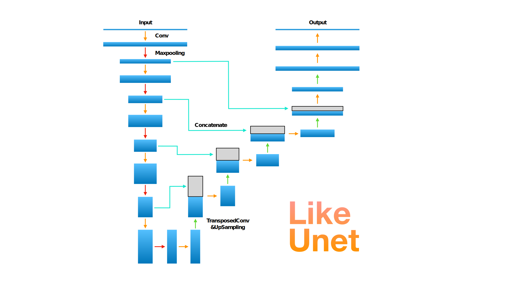
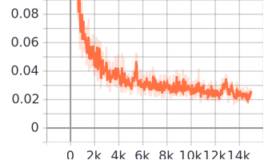
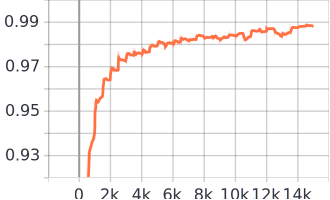
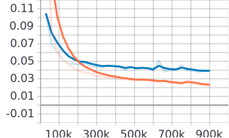
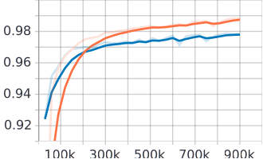

# humanMatting

Keras implementation of Simplified Unet (i.e. **LikeUnet**) for semantic human matting

## DataSet

The data set can be found on [Kaggle Matting Human Datasets](https://www.kaggle.com/laurentmih/aisegmentcom-matting-human-datasets).

Quoting from the dataset [author's GitHub](https://github.com/aisegmentcn/matting_human_datasets)
> This dataset is currently the largest portrait matting dataset, containing 34,427 images and corresponding matting results. The data set was marked by the high quality of Beijing Play Star Convergence Technology Co., Ltd., and the portrait soft segmentation model trained using this data set has been commercialized. The original images in the dataset are from Flickr, Baidu, and Taobao. After face detection and area cropping, a half-length portrait of 600*800 was generated. 

## Architecture

### FCN

FCN stands for **Fully Convolutional Network**. It is originally proposed in *[Fully Convolutional Networks for Semantic Segmentation](https://arxiv.org/abs/1605.06211)*, to solve image segmentation problems. This specific model FCN-8s used in `info/FCNberkeley.ipynb` can be found in [BerkeleyVision](https://github.com/shelhamer/fcn.berkeleyvision.org) and it is trained on [PASCAL VOC](http://host.robots.ox.ac.uk/pascal/VOC/).


### Unet

UNet was first designed especially for medical image segmentation. *[U-Net: Convolutional Networks for Biomedical Image Segmentation](https://arxiv.org/abs/1505.04597)* is accepted at MICCAI 2015.

Unet Structure ("U" shape network)


### LikeUnet

With tools as powerful as Unet, the image segmentation is a relatively easy job. Since we care about training speed, model size, and performance, LikeUnet is, well, like Unet, but with less convolution layers kernels.



Experimental works are done in `info/FCN.ipynb`. You can find different models and ideas in that notebook (more like a draft).

#### Training Info (Smoothed)

Batch loss (Cross entropy loss)

Batch mIoU (mean Intersection over Union)

Epoch loss (Cross entropy loss) (Train: Orange, Val: Blue)

Epoch mIoU (mean Intersection over Union) (Train: Orange, Val: Blue)


#### Model size
    
Params (weights) is around 7MB

#### Performance

#### Night series

Human Matting in RGB.

- `models/night.json`: Human readable architecture. It accepts input shape of (batch_size, 32xH, 32xW, 3).

- `models/night-15-0.9714.h5`: Best model in terms of validation mean IoU (Intersection over Union). It is the model at the end of epoch 15 and it has validation mean IoU of 97.14%.

#### Dark series

Human Matting in Grayscale.

- `models/dark.json`: Human readable architecture. It accepts input shape of (batch_size, 32xH, 32xW, 1).

- `models/dark-28-0.9787.h5`: Best model in terms of validation mean IoU (Intersection over Union). It is the model at the end of epoch 28/30 and it has validation mean IoU of 97.87%.

## Dependency

- Numpy
- Opencv-python
- Tensorflow (2.0 with Keras)
- Jupyter Notebook

```bash
pip install -r requirements.txt
```

## Usage

Training happens inside `train/train.ipynb`. Feel free to take a look. Keras is quite simple compared to other deep learning framework.

Demo usage

```
usage: demo.py [-h] [--gray] path

Demo model on images or videos

positional arguments:
  path        path to an image or a video

optional arguments:
  -h, --help  show this help message and exit
  --gray      segmentation in gray mode. RGB by default.
```

Use ```python demo.py 0``` to enable camera.
